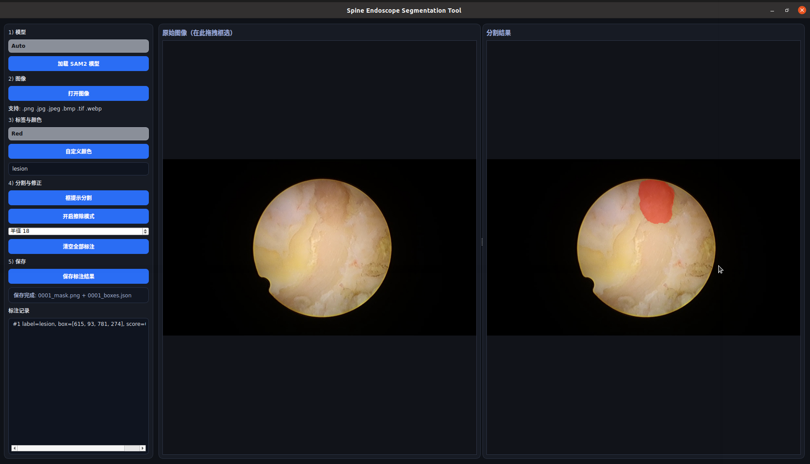

# SpineEndo-Segmentation-Tool

## 1. Requirements
```
conda create -n segtool python=3.8
conda activate segtool
pip install -r requirements.txt
```
## 1. Dataset
We provide sample data and support loading  one or two modal data. The sample dataset can be found [here](Data)

- 加载常见图像格式：`.png`、`.jpg`、`.jpeg`、`.bmp`、`.tif`、`.tiff`、`.webp`
- 手动框选提示（Box Prompt）触发分割
- 原图与分割结果并排显示，并保持同样显示尺寸
- 选择多种标注颜色（预设 + 自定义）
- 保存分割结果为 `.png`
- 同时保存提示框坐标和标注元数据（`.json`）

## 1. 环境准备

推荐 Python 3.10+。

```bash
python -m venv .venv
source .venv/bin/activate
pip install --upgrade pip
pip install -r requirements.txt
```

> 如果你的环境安装 `sam2` 失败，可单独执行：
>
> ```bash
> pip install git+https://github.com/facebookresearch/sam2.git
> ```

## 2. 准备 SAM2 模型文件

运行程序时需要你本地提供 SAM2 权重文件（`.pt` / `.pth`）。
程序会根据权重文件名（`tiny/small/base_plus/large`）自动匹配对应配置。

可从官方仓库下载你需要的配置和 checkpoint:

[sam2.1_hiera_tiny](https://dl.fbaipublicfiles.com/segment_anything_2/092824/sam2.1_hiera_tiny.pt)

[sam2.1_hiera_small](https://dl.fbaipublicfiles.com/segment_anything_2/092824/sam2.1_hiera_small.pt)

[sam2.1_hiera_base_plus](https://dl.fbaipublicfiles.com/segment_anything_2/092824/sam2.1_hiera_base_plus.pt)

[sam2.1_hiera_large](https://dl.fbaipublicfiles.com/segment_anything_2/092824/sam2.1_hiera_large.pt)

## 3. 启动软件

```bash
python app.py
```

## 4. 使用流程

1. 点击 **加载 SAM2 模型**，选择 `.pt` 权重文件  
2. 点击 **打开图像**，加载内镜影像  
3. 选择标注颜色与标签名  
4. 在左侧原图上鼠标拖拽画框  
5. 点击 **框提示分割** 生成分割结果  
6. 重复框选可叠加多个目标  
7. 点击 **保存标注结果**

## 5. 导出文件说明

保存后会生成 3 个文件（示例输入图像名 `case001.jpg`）：

- `case001_mask.png`：彩色分割掩膜（每个标注区域为所选颜色）
- `case001_label.png`：灰度标签图（标注序号 1~255）
- `case001_boxes.json`：框坐标与标签元数据

`json` 示例结构：

```json
{
  "image_path": "/path/to/case001.jpg",
  "mask_path": "/save/path/case001_mask.png",
  "label_mask_path": "/save/path/case001_label.png",
  "annotations": [
    {
      "id": 1,
      "label": "lesion",
      "color_rgb": [255, 0, 0],
      "box_xyxy": [100, 120, 280, 360],
      "sam_score": 0.97
    }
  ]
}
```

## 6. 注意事项

- 若有 NVIDIA GPU，程序会自动优先使用 CUDA；否则回退 CPU。
- 首次分割速度受模型大小和硬件影响。
- 当前工具为单张图像交互标注，适合精细人工标注场景。
